# Rotary-Crystallizer

A Modern Holden style Rotary Crystallizer, using off the shelf parts (apart from PCB), capable of growing large optically clear crystals of Potassium DiHydrogen Phosphate (KDP) in just 7 days!
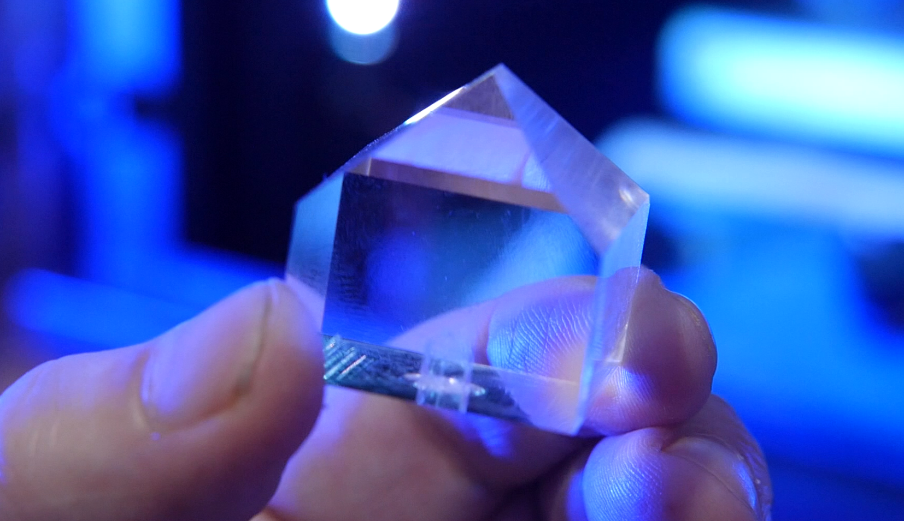

## Theory

Quanitities and Graphs
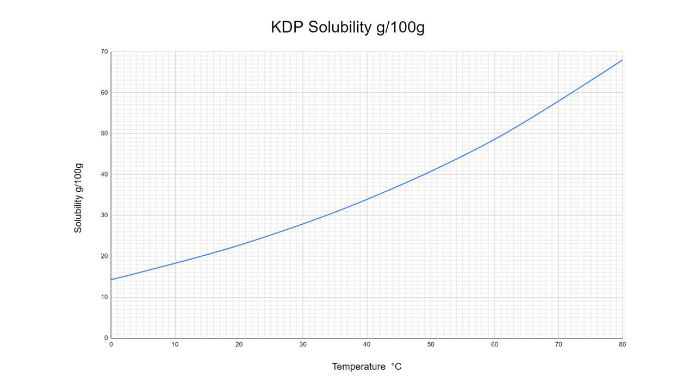

Above is solubility data derived from data at https://www.sigmaaldrich.com/GB/en/support/calculators-and-apps/solubility-table-compounds-water-temperature

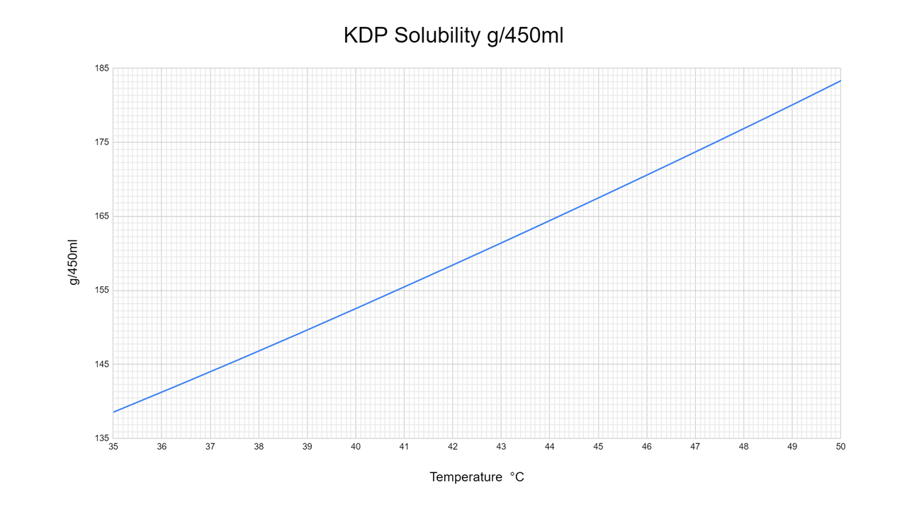

Above: Solubilty curve assuming 450ml of solvent.

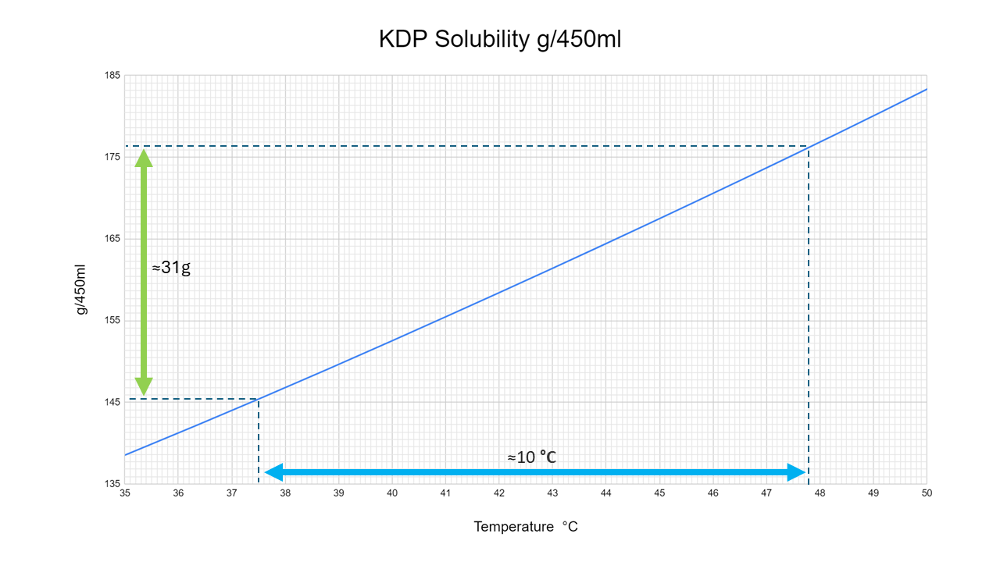

Above: Projected crystal mass for a 10C temperature drop.

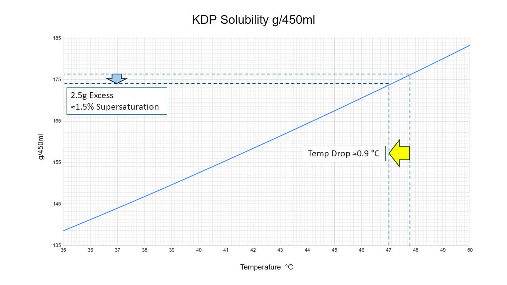

Initial start temperature of 47C. This is 0.9C below the saturation point, giving an intitial supersaturation of 1.5%

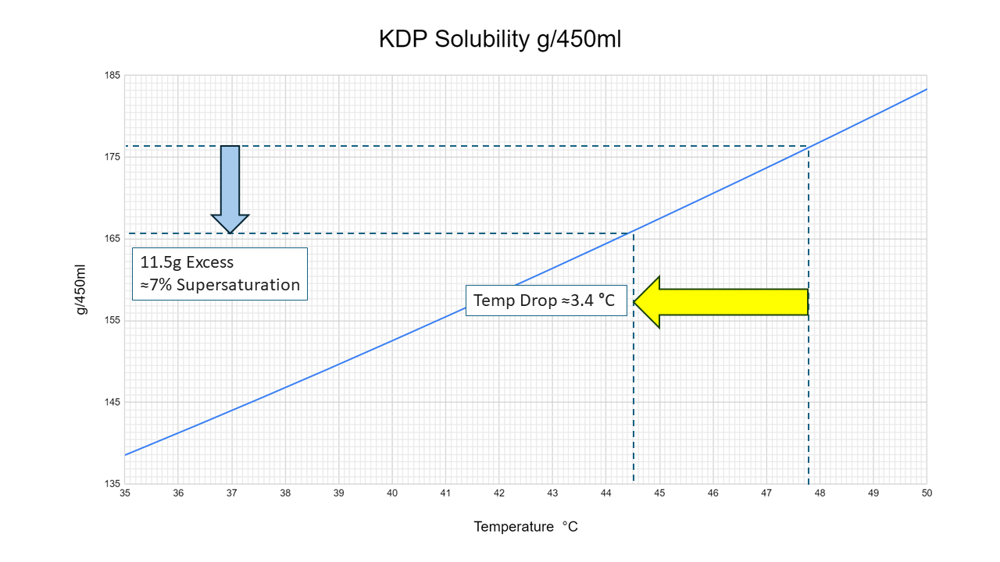

At 44.5C the projected supersaturation is about 7%. This does not take into account crystal growth in this period, and is likely closer to 6% during a growth cycle. This puts the supersaturation level in te fast growth regime.

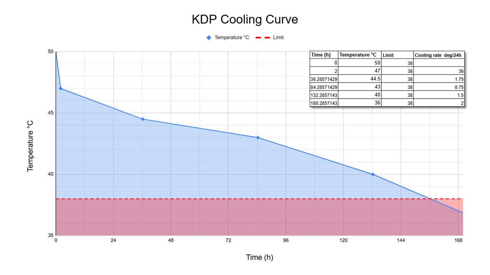

## Hardware

BOM 

### LightBurn Files

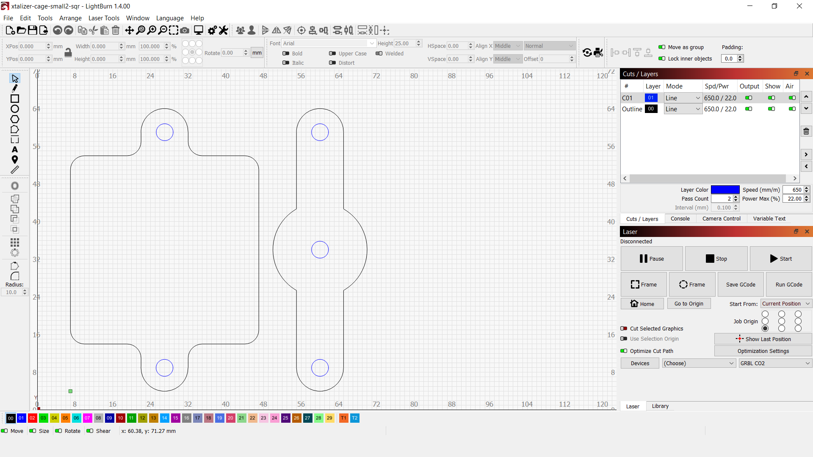

## PCB Design

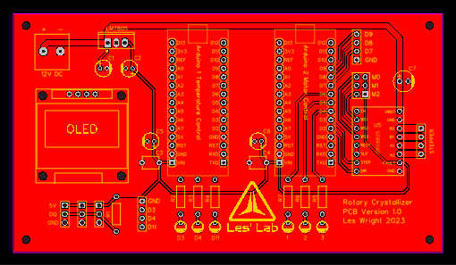

TODO:
0.96" OLED SSD1306
The hole spacing for the OLED needs attending to! Seemingly different manufacturers have different hole spacings, mechanical drawings are thin on the ground CHECK the measurements for your OLED and edit the PCB to suit before sending files off for Manufacture!!!
Future versions will simply omit the holes. Honestly you might be better off mouting with double sided foam pads and soldering direct to the board.
I2C breakout is planned in version 2 for TMP117 sensors and expandability.

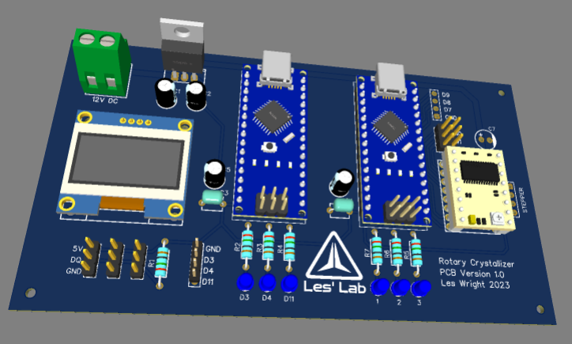

## Arduino code

## Python Data Processing

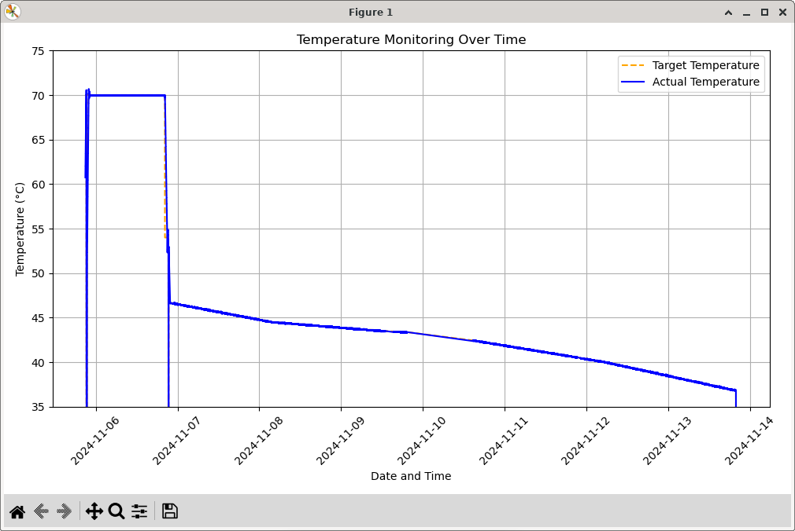
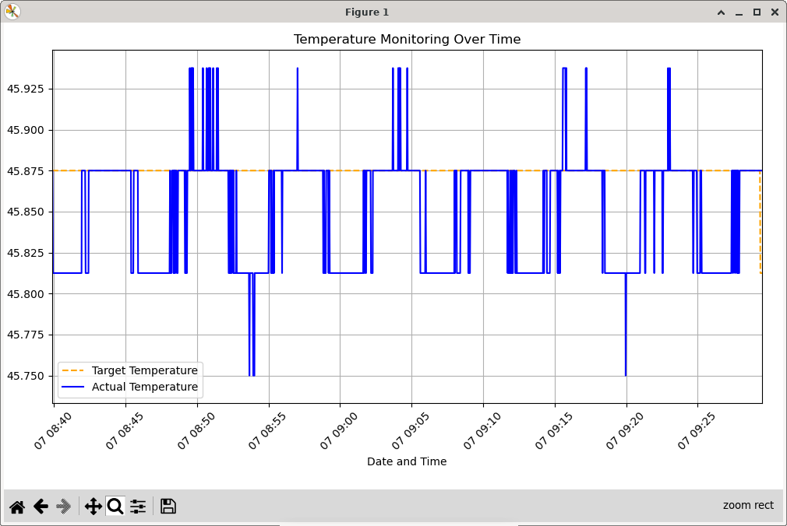
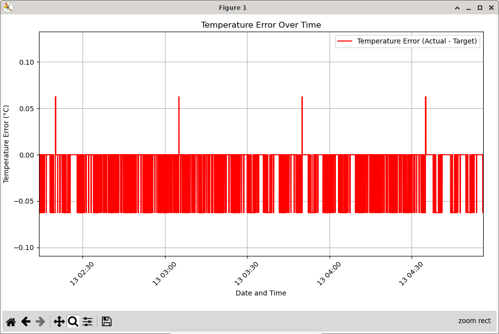

